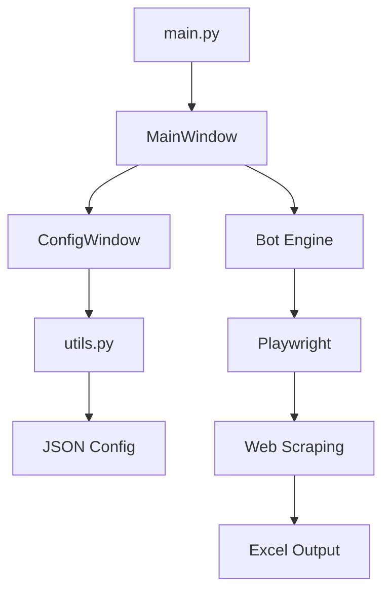

# Documentación Técnica - AutoOmegaBot

## Tabla de Contenidos

1. [Arquitectura del Sistema](#arquitectura-del-sistema)
2. [Módulos y Componentes](#módulos-y-componentes)
3. [API de Utilidades](#api-de-utilidades)
4. [Interfaz Gráfica](#interfaz-gráfica)
5. [Sistema de Configuración](#sistema-de-configuración)
6. [Automatización Web](#automatización-web)
7. [Gestión de Datos](#gestión-de-datos)
8. [Sistema de Logs](#sistema-de-logs)
9. [Validaciones](#validaciones)
10. [Extensibilidad](#extensibilidad)

---

## Arquitectura del Sistema

### Patrón MVC Implementado

```
Model (Datos)           View (Interfaz)         Controller (Lógica)
├── utils.py           ├── gui.py              ├── main.py
├── config.json        ├── Settings_Ui/        ├── bot.py
└── logs/              └── assets.py           └── validaciones
```

### Flujo de Datos



---

## Módulos y Componentes

### 1. Módulo Principal (`main.py`)

**Propósito**: Punto de entrada de la aplicación

```python
class Application:
    """
    Controlador principal de la aplicación
    """
    def __init__(self):
        self.app = QtWidgets.QApplication(sys.argv)
        self.window = MainWindow()
    
    def run(self):
        """Ejecutar la aplicación"""
        return self.app.exec_()
```

### 2. Interfaz Principal (`Ui/gui.py`)

#### Clase MainWindow

**Responsabilidades**:
- Gestionar la interfaz principal
- Coordinar widgets y eventos
- Mostrar logs y métricas
- Controlar estado del bot

**Componentes clave**:

```python
class MainWindow(QtWidgets.QMainWindow):
    """
    Ventana principal de la aplicación
    
    Attributes:
        bot_running (bool): Estado del bot
        config (dict): Configuración actual
        selected_file (str): Archivo seleccionado
        log_widget (LogWidget): Widget de logs
        status_widgets (list): Widgets de estado
    """
```

#### Widgets Personalizados

##### StatusWidget
```python
class StatusWidget(QtWidgets.QWidget):
    """
    Widget para mostrar métricas del sistema
    
    Args:
        title (str): Título del widget
        value (str): Valor a mostrar
        color (str): Color de fondo
    """
    def update_value(self, value):
        """Actualizar valor mostrado"""
    
    def update_color(self, color):
        """Cambiar color del widget"""
```

##### LogWidget
```python
class LogWidget(QtWidgets.QTextEdit):
    """
    Widget especializado para logs con formato
    
    Features:
        - Colores por nivel de severidad
        - Timestamps automáticos
        - Exportación a texto plano
    """
    def add_log(self, message, level="INFO"):
        """Agregar entrada de log con formato"""
```

### 3. Sistema de Configuración (`Settings_Ui/`)

#### Estructura Modular

```
Settings_Ui/
├── setting_gui.py      # Ventana principal de configuración
├── General/
│   └── general.py      # Configuración de carpetas
├── Fecha/
│   └── fecha.py        # Configuración de fechas
├── Estrategia/
│   └── estrategia.py   # Configuración de estrategias
└── Fondos/
    └── fondos.py       # Configuración de fondos
```

#### ConfigWindow Principal

```python
class ConfigWindow(QtWidgets.QDialog):
    """
    Ventana principal de configuración
    
    Signals:
        config_saved: Emitida al guardar configuración
    """
    def __init__(self, config, parent=None):
        # Inicializar páginas de configuración
        self.general_page = GeneralPage(config)
        self.dates_page = DatesPage(config)
        self.strategy_page = StrategyPage(config)
        self.funds_page = FundsPage(config)
```

#### Páginas de Configuración

##### General (`General/general.py`)
- **FilePathSelector**: Selector de carpetas con validación automática
- **Funciones**: Gestión de rutas de salida, validación de estructura

##### Fecha (`Fecha/fecha.py`)
- **DateRangeSelector**: Selector de rango de fechas
- **Validación**: Formatos DD/MM/YYYY y MM/DD/YYYY
- **Funciones**: Validación de rangos, fechas válidas

##### Estrategia (`Estrategia/estrategia.py`)
- **StrategySelector**: Configuración completa de estrategias
- **Componentes**: Dropdowns, inputs numéricos, toggles
- **Validación**: Parámetros de estrategia válidos

##### Fondos (`Fondos/fondos.py`)
- **FundsConfiguration**: Configuración de capital y márgenes
- **Campos obligatorios**: Capital inicial, porcentaje margen, contratos máximos
- **Validación**: Montos válidos, porcentajes en rango

---

## API de Utilidades (`Utiles/utils.py`)

### Funciones de Configuración

```python
def load_config() -> dict:
    """
    Cargar configuración desde JSON
    
    Returns:
        dict: Configuración con valores por defecto
    """

def save_config(config: dict) -> bool:
    """
    Guardar configuración en JSON
    
    Args:
        config: Diccionario de configuración
        
    Returns:
        bool: True si se guardó exitosamente
    """
```

### Funciones de Validación

```python
def validate_system_ready(config: dict, selected_file: str) -> tuple:
    """
    Validar que el sistema esté listo para ejecutar
    
    Args:
        config: Configuración actual
        selected_file: Archivo seleccionado
        
    Returns:
        tuple: (is_ready, message)
    """

def get_validation_status(config: dict, selected_file: str) -> dict:
    """
    Obtener estado detallado de validación
    
    Returns:
        dict: {
            'internet': bool,
            'file_valid': bool,
            'dates_valid': bool,
            'funds_valid': bool,
            'overall_valid': bool,
            'errors': list
        }
    """
```

### Funciones de Archivos

```python
def get_system_documents_folder() -> str:
    """
    Detectar carpeta Documents del sistema (multiidioma)
    
    Soporta:
        - Windows: API del sistema
        - Linux: xdg-user-dirs
        - macOS: Ruta estándar
        
    Returns:
        str: Ruta a carpeta Documents
    """

def get_output_folder() -> str:
    """Obtener carpeta de salida por defecto"""

def get_config_folder() -> str:
    """Obtener carpeta de configuración"""

def get_logs_folder() -> str:
    """Obtener carpeta de logs"""
```

### Funciones de Conexión

```python
def check_internet_connection() -> bool:
    """
    Verificar conexión a internet
    
    Testea múltiples servicios:
        - Google DNS (8.8.8.8)
        - Cloudflare DNS (1.1.1.1)
        - HTTP requests a sitios confiables
    """

def get_connection_status() -> dict:
    """Obtener estado detallado de conexión"""
```

---

## Sistema de Automatización Web (`Bot/bot.py`)

### Arquitectura del Bot

```python
class WebBot:
    """
    Bot principal para automatización web
    
    Attributes:
        browser: Instancia de Playwright browser
        page: Página web actual
        config: Configuración del bot
    """
    
    def __init__(self, config: dict):
        self.config = config
        self.browser = None
        self.page = None
    
    async def start_browser(self):
        """Inicializar navegador con configuración"""
    
    async def process_url(self, url: str) -> dict:
        """
        Procesar una URL individual
        
        Args:
            url: URL a procesar
            
        Returns:
            dict: Resultados del análisis
        """
    
    async def click_new_backtest(self):
        """Hacer clic en botón 'New Backtest'"""
    
    async def configure_backtest(self, test_type: str):
        """
        Configurar parámetros del backtest
        
        Args:
            test_type: 'ytd' o fecha específica
        """
    
    async def extract_results(self) -> dict:
        """Extraer resultados de la página"""
```

### Selectores Web

```python
# Selectores para elementos web
SELECTORS = {
    'new_backtest_button': 'button:has-text("New Backtest")',
    'ytd_button': 'button:has-text("YTD")',
    'date_input': 'input[type="date"]',
    'run_button': 'button:has-text("Run")',
    'results_table': 'table.results',
    'results_values': '.result-value'
}
```

### Estrategias de Selección

1. **Por texto**: `page.click("text='New Backtest'")`
2. **Por CSS**: `page.click(".btn-primary")`
3. **Por XPath**: `page.click("//button[contains(text(), 'Run')]")`
4. **Por índice**: `page.locator(".button").nth(0).click()`

---

## Gestión de Datos

### Lectura de Excel

```python
import pandas as pd
import openpyxl

def read_urls_from_excel(file_path: str) -> list:
    """
    Leer URLs desde archivo Excel
    
    Args:
        file_path: Ruta al archivo Excel
        
    Returns:
        list: Lista de URLs válidas
    """
    df = pd.read_excel(file_path, engine='openpyxl')
    urls = df.iloc[:, 0].dropna().tolist()  # Columna A
    return [url for url in urls if validate_url(url)]
```

### Escritura de Resultados

```python
def write_results_to_excel(results: list, output_path: str):
    """
    Escribir resultados a Excel
    
    Args:
        results: Lista de resultados de análisis
        output_path: Ruta de archivo de salida
    """
    df = pd.DataFrame(results)
    
    # Aplicar formato
    with pd.ExcelWriter(output_path, engine='openpyxl') as writer:
        df.to_excel(writer, sheet_name='Resultados', index=False)
        
        # Formatear celdas
        workbook = writer.book
        worksheet = writer.sheets['Resultados']
        
        # Aplicar estilos...
```

### Estructura de Datos de Salida

```python
# Estructura típica de resultados
result = {
    'url': 'https://example.com/analysis',
    'timestamp': '2024-01-15 10:30:45',
    'ytd_results': {
        'profit_loss': 1250.50,
        'win_rate': 0.65,
        'max_drawdown': -350.25,
        'sharpe_ratio': 1.42
    },
    'custom_date_results': {
        'profit_loss': 850.30,
        'win_rate': 0.58,
        'max_drawdown': -280.15,
        'sharpe_ratio': 1.15
    },
    'status': 'completed',
    'errors': []
}
```

---

## Sistema de Logs

### Niveles de Log

```python
LOG_LEVELS = {
    'DEBUG': {'color': '#95a5a6', 'prefix': '🔍'},
    'INFO': {'color': '#3498db', 'prefix': 'ℹ️'},
    'SUCCESS': {'color': '#27ae60', 'prefix': '✅'},
    'WARNING': {'color': '#f39c12', 'prefix': '⚠️'},
    'ERROR': {'color': '#e74c3c', 'prefix': '❌'}
}
```

### Formato de Logs

```python
def format_log_entry(message: str, level: str) -> str:
    """
    Formatear entrada de log
    
    Formato: [TIMESTAMP] [LEVEL] [PREFIX] MESSAGE
    """
    timestamp = datetime.now().strftime('%H:%M:%S')
    prefix = LOG_LEVELS[level]['prefix']
    return f"[{timestamp}] [{level}] {prefix} {message}"
```

### Persistencia

```python
def save_logs(log_content: str, config: dict = None, selected_file: str = None):
    """
    Guardar logs en archivo con información del sistema
    
    Estructura del archivo:
        - Header con información del sistema
        - Configuración actual
        - Logs de la sesión
        - Footer con resumen
    """
```

---

## Validaciones

### Validación de Fechas

```python
def validate_date_format(date_string: str) -> tuple:
    """
    Validar formato de fecha (soporta DD/MM/YYYY y MM/DD/YYYY)
    
    Returns:
        tuple: (is_valid, error_message)
    """
    formats = ["%d/%m/%Y", "%m/%d/%Y"]
    for fmt in formats:
        try:
            datetime.strptime(date_string, fmt)
            return True, "Formato válido"
        except ValueError:
            continue
    return False, "Formato debe ser DD/MM/YYYY o MM/DD/YYYY"

def validate_date_range(start_date: str, end_date: str) -> tuple:
    """Validar que el rango de fechas sea coherente"""
```

### Validación de Archivos

```python
def validate_file_path(file_path: str) -> tuple:
    """
    Validar archivo Excel
    
    Verifica:
        - Existencia del archivo
        - Extensión (.xlsx, .xls)
        - Permisos de lectura
        - Estructura básica
    """
```

### Validación de Fondos

```python
def validate_funds_config(config: dict) -> tuple:
    """
    Validar configuración de fondos
    
    Verifica:
        - Campos obligatorios
        - Rangos válidos
        - Consistencia de parámetros
    """
```

---

## Extensibilidad

### Agregar Nuevas Estrategias

1. **Definir en utils.py**:
```python
def get_available_strategies():
    return [
        "Select strategy",
        "Iron Condor",
        "Covered Call",
        "Protective Put",
        "Bull Call Spread",
        # Nueva estrategia aquí
        "Custom Strategy"
    ]
```

2. **Implementar lógica en bot.py**:
```python
async def configure_custom_strategy(self):
    """Configurar nueva estrategia"""
    # Implementar lógica específica
```

### Agregar Nuevos Widgets

1. **Crear widget personalizado**:
```python
class CustomWidget(QtWidgets.QWidget):
    """Nuevo widget personalizado"""
    
    def __init__(self, parent=None):
        super().__init__(parent)
        self.setup_ui()
    
    def setup_ui(self):
        # Implementar interfaz
        pass
```

2. **Integrar en MainWindow**:
```python
def add_custom_widget(self):
    """Agregar widget personalizado a la interfaz"""
    self.custom_widget = CustomWidget()
    self.layout.addWidget(self.custom_widget)
```

### Agregar Nuevas Validaciones

```python
def validate_custom_parameter(value: str) -> tuple:
    """
    Validar parámetro personalizado
    
    Args:
        value: Valor a validar
        
    Returns:
        tuple: (is_valid, error_message)
    """
    # Implementar lógica de validación
    return True, "Válido"

# Agregar a get_validation_status()
def get_validation_status(config, selected_file):
    # ... validaciones existentes ...
    
    # Nueva validación
    custom_valid = validate_custom_parameter(config.get('custom_param'))
    
    status['custom_valid'] = custom_valid[0]
    if not custom_valid[0]:
        errors.append(custom_valid[1])
```

---

## Configuración Avanzada

### Variables de Entorno

```python
import os

# Configuración de debug
DEBUG_MODE = os.getenv('OMEGA_DEBUG', 'False').lower() == 'true'

# Timeouts personalizados
WEB_TIMEOUT = int(os.getenv('OMEGA_TIMEOUT', '30'))

# Modo headless
HEADLESS_MODE = os.getenv('OMEGA_HEADLESS', 'True').lower() == 'true'
```

### Configuración JSON Avanzada

```json
{
  "system": {
    "debug_mode": false,
    "max_retries": 3,
    "timeout_seconds": 30,
    "headless_browser": true
  },
  "trading": {
    "default_ticker": "SPY",
    "risk_management": {
      "max_position_size": 0.1,
      "stop_loss_percent": 0.05
    }
  },
  "ui": {
    "theme": "dark",
    "auto_save_logs": true,
    "show_debug_info": false
  }
}
```

---

## Troubleshooting y Debug

### Logging de Debug

```python
def enable_debug_logging():
    """Habilitar logging detallado para troubleshooting"""
    import logging
    
    logging.basicConfig(
        level=logging.DEBUG,
        format='%(asctime)s - %(name)s - %(levelname)s - %(message)s',
        handlers=[
            logging.FileHandler('debug.log'),
            logging.StreamHandler()
        ]
    )
```

### Funciones de Diagnóstico

```python
def system_diagnostic() -> dict:
    """
    Ejecutar diagnóstico completo del sistema
    
    Returns:
        dict: Estado de todos los componentes
    """
    return {
        'python_version': platform.python_version(),
        'qt_version': QtCore.QT_VERSION_STR,
        'playwright_installed': check_playwright(),
        'permissions': check_file_permissions(),
        'network': check_network_connectivity(),
        'dependencies': check_dependencies()
    }
```

---

## Performance y Optimización

### Optimizaciones Implementadas

1. **Lazy Loading**: Widgets se crean solo cuando se necesitan
2. **Async Operations**: Operaciones web asíncronas
3. **Memory Management**: Cleanup automático de recursos
4. **Caching**: Cache de configuraciones y datos frecuentes

### Métricas de Performance

```python
class PerformanceMonitor:
    """Monitor de rendimiento del sistema"""
    
    def __init__(self):
        self.start_time = time.time()
        self.operations_count = 0
        self.memory_usage = []
    
    def track_operation(self, operation_name: str):
        """Trackear operación individual"""
        
    def get_stats(self) -> dict:
        """Obtener estadísticas de rendimiento"""
```

---

## Seguridad

### Validación de Entrada

```python
def sanitize_input(user_input: str) -> str:
    """Sanitizar entrada del usuario"""
    # Remover caracteres peligrosos
    # Validar longitud
    # Escapar caracteres especiales
    return cleaned_input
```

### Manejo de Credenciales

```python
def secure_store_credentials(credentials: dict):
    """Almacenar credenciales de forma segura"""
    # Usar keyring del sistema operativo
    # Encriptar datos sensibles
    # No almacenar en texto plano
```

---

Esta documentación técnica proporciona una visión completa del sistema AutoOmegaBot, sus componentes, API y extensibilidad. Para información específica de instalación y uso, consulta `INSTALL.md` y `README.md`.